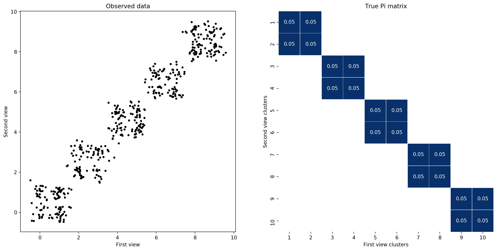

Multi-view mixture models
-------------------------

**author**: `Iain Carmichael`_

mvmm provides several algorithms for learning multi-view mixture models (Bickel and Scheffer, 2004; Carmichael, 2020). In this model, the structure of the "cluster membership matrix" (Pi from Carmichael, 2020) captures how information is shared between the data views. This package focuses on estimating the sparity structure of Pi using the log penalized MVMM or the block diagonally constrained MVMM.

Details of these methods can be found in Learning sparsity and block diagonal structure in multi-view mixture models (Link comming soon!)

Installation
============

mvmm can be installed via pip or github. This package is currently only tested in python 3.6.

::

    git clone https://github.com/idc9/mvmm.git
    python setup.py install

Example
=======

The below example fits a two view, block diagonal multi-view mixture model and performs model selection using BIC.

First we sample data from a two view data set where Pi is block diagonal matrix with 5 2x2 blocks.

.. code:: python

    from mvmm.single_view.gaussian_mixture import GaussianMixture
    from mvmm.multi_view.BlockDiagMVMM import BlockDiagMVMM
    from mvmm.multi_view.MVMM import MVMM
    from mvmm.multi_view.TwoStage import TwoStage

    from mvmm.multi_view.block_diag.toy_data import get_01_block_diag
    from mvmm.multi_view.toy_data import sample_gmm, setup_grid_mean_view_params

    Pi_true = get_01_block_diag(block_shapes=[(2, 2)] * 5)
    Pi_true /= Pi_true.sum()
    n_view_components = Pi_true.shape

    clust_param_config = {'n_features': [1, 1],
                          'cluster_std': .25,  # how noisey each cluster is
                          'random_state': 44}
    view_params = setup_grid_mean_view_params(n_view_components,
                                              **clust_param_config)
    view_data, Y_true = sample_gmm(view_params, Pi_true, n_samples=500,
                                   random_state=233)

Next we fit the block diagonally constrained MVMM

.. code:: python

    # spcify view spcific models
    base_view_models = [GaussianMixture(n_components=n_view_components[v])
                    for v in range(2)]

    # initialize with a few EM of the basic MVMM
    base_start = MVMM(base_view_models=base_view_models, max_n_steps=10)

    # setup block diagonal model
    base_final = BlockDiagMVMM(n_blocks=5, base_view_models=base_view_models)

    mvmm = TwoStage(base_start=base_start, base_final=base_final,
                    n_init=1, random_state=883)

    mvmm.fit(view_data)

Plot the block diagonal weights matrix stored in mvmm.final_.bd_weights_

For more example code see `these example notebooks`_. If the notebooks aren't loading on github you can copy/paste the notebook url into https://nbviewer.jupyter.org/.

Help and Support
================

Additional documentation, examples and code revisions are coming soon.
For questions, issues or feature requests please reach out to Iain:
idc9@cornell.edu.

Documentation
^^^^^^^^^^^^^

The source code is located on github: https://github.com/idc9/mvmm

.. Testing
.. ^^^^^^^

.. Testing is done using `nose`.

Contributing
^^^^^^^^^^^^

We welcome contributions to make this a stronger package: data examples,
bug fixes, spelling errors, new features, etc.

Citing
^^^^^^

@article{carmichael2020learning,
  title={Learning sparsity and block diagonal structure in multi-view mixture models},
  author={Carmichael, Iain},
  journal={arXiv preprint arXiv: TODO},
  year={2020}
}

References
==========

Bickel, S. and Scheffer, T., 2004. Multi-view clustering. In ICDM (Vol. 4, No. 2004, pp. 19-26).

Carmichael, I. 2020. Learning sparsity and block diagonal structure in multi-view mixture models. Arxiv preprint.

.. _Iain Carmichael: https://idc9.github.io/
.. _these example notebooks: https://github.com/idc9/mvmm/tree/master/doc/example_notebooks
